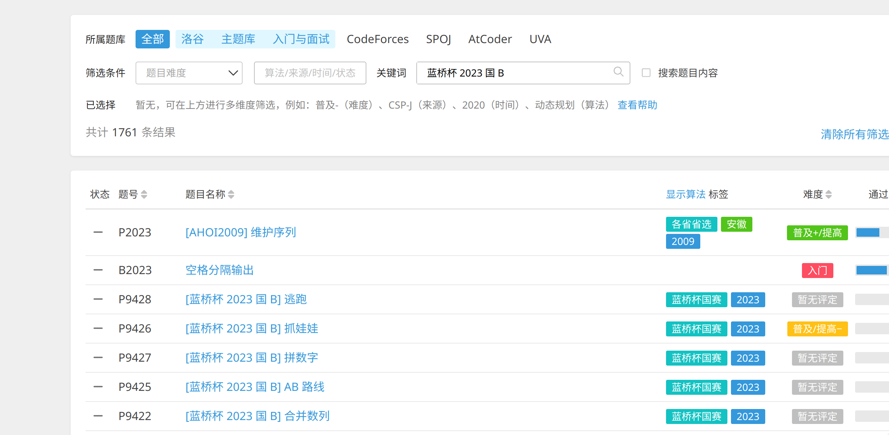

+ 完成博弈论专题学习 https://vjudge.net/contest/624995

+ dp专题

  > [总体题单](https://blog.csdn.net/qq_37774171/article/details/81188690)

  + 基础dp
    + 完成上述链接中的 递推，LIS，LCS 部分的所有题目
  + 背包
    + 资料：[27000字初级背包问题详解 - 知乎 (zhihu.com)](https://zhuanlan.zhihu.com/p/430195885)
    + 习题：https://blog.csdn.net/woshi250hua/article/details/7636866

+ 比赛

  + 正式赛：5.4, 20:00开始 https://atcoder.jp/contests/abc352

  + 蓝桥杯 2023 国B 题目，洛谷可以直接像下面这样搜索可以搜到

    

硬性要求：博弈论专题 + 一场正式赛（至少补到E题） + 基础dp的递推部分的习题